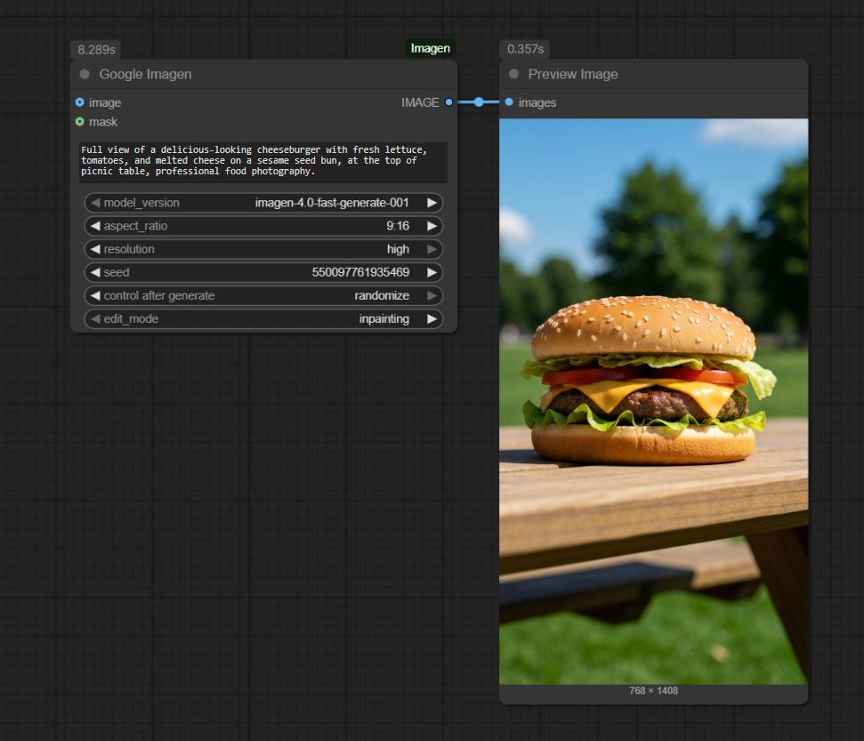
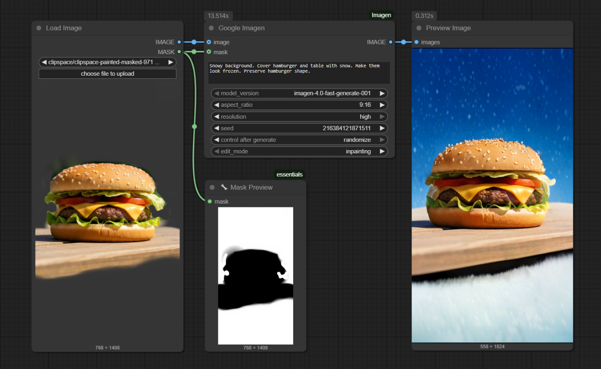

# ComfyUI_Imagen

[](https://opensource.org/licenses/MIT)
[](https://www.python.org/downloads/release/python-3120/)
[](https://deepmind.google/technologies/gemini/)

A custom node for ComfyUI that leverages the Google Cloud Vertex AI Imagen 4.0 API to generate and edit images.

## Installation

1.  Clone this repository into your `custom_nodes` folder.
    ```bash
    cd ComfyUI/custom_nodes
    git clone https://github.com/ru4ls/ComfyUI_Imagen.git
    ```
2.  Install the required dependencies:
    ```bash
    pip install -r ComfyUI_Imagen/requirements.txt
    ```

## Nodes

### Google Imagen

## Project Setup

To use this node, you need a Google Cloud Project with the Vertex AI API enabled.

1.  **Enable the Vertex AI API:** Follow the instructions in the [Google Cloud documentation](https://cloud.google.com/vertex-ai/docs/start/cloud-environment) to enable the API for your project.

2.  **Install and Authenticate gcloud:** This node requires the [Google Cloud SDK](https://cloud.google.com/sdk/docs/install) to be installed. After installation, you must authenticate your user account by running the following command in your terminal:
    ```bash
    gcloud auth application-default login
    ```
    The Python environment running the node must be able to find the `gcloud` executable. If `gcloud` is not in your system's standard PATH, you can specify its location manually. See the `config.ini` step below.

3.  **Create a `.env` file:** Create a `.env` file in the `ComfyUI_Imagen` directory by copying the `.env.example` file. Replace the placeholder values with your Google Cloud project ID and desired location.
    ```
    PROJECT_ID="YOUR_PROJECT_ID_HERE"
    LOCATION="us-central1"
    ```

4.  **(Optional) Create `config.ini` for gcloud Path:** If the node returns a "gcloud not found" error, it means the script cannot find the Google Cloud SDK. You can fix this by creating a `config.ini` file in the `ComfyUI_Imagen` directory and specifying the full path to the executable.

    Example `config.ini` for Windows:
    ```ini
    [gcloud]
    path = C:\Users\UserName\AppData\Local\Google\Cloud SDK\google-cloud-sdk\bin\gcloud.cmd
    ```
    *Note: Use the correct path for your operating system.*

**Inputs:**

*   `prompt` (STRING): The text prompt for image generation or manipulation.
*   `model_version` (STRING): The Imagen 4.0 model to use. Options are "imagen-4.0-fast-generate-001" and "imagen-4.0-ultra-generate-001". The same models are used for both text-to-image and image editing tasks.
*   `aspect_ratio` (STRING): The desired aspect ratio of the generated image.
*   `resolution` (STRING): The desired resolution of the generated image ("standard" or "high").
*   `seed` (INT, optional): Seed for reproducibility. *(Note: See Known Limitations below)*.
*   `image` (IMAGE, optional): A reference image for editing.
*   `mask` (MASK, optional): A mask for inpainting or outpainting.
*   `edit_mode` (STRING, optional): The editing mode to use. Options are "inpainting" and "outpainting".

**Outputs:**

*   `image` (IMAGE): The generated or edited image.


## Known Limitations

### Seed Parameter
The Google Imagen 4.0 API does not currently support using a `seed` value when the automatic watermark feature is enabled. As watermarking is on by default, this node currently ignores the `seed` input to prevent API errors. All generated images will be non-deterministic.

### Image Editing
Imagen 4.0 models currently only support image editing operations (like inpainting and outpainting) when both an `image` and a `mask` are provided. Mask-free image editing is not directly supported by the Imagen 4.0 API.

## Example Usage

### Text to Image Generation

1.  Add the `Google Imagen` node to your workflow.
2.  Enter a `prompt`.
3.  Ensure no `image` or `mask` inputs are connected.
4.  Connect the output `image` to a `PreviewImage` or `SaveImage` node to see the result.

**Sample Prompt:** "A delicious-looking cheeseburger with fresh lettuce, tomatoes, and melted cheese on a sesame seed bun, professional food photography"




### Inpainting

1.  Add the `Google Imagen` node to your workflow.
2.  Connect a `LoadImage` node to the `image` input.
3.  Create a mask and connect it to the `mask` input.
4.  Enter a `prompt` describing the desired changes within the masked area.
5.  Set `edit_mode` to `inpainting`.
6.  Connect the output `image` to a `PreviewImage` or `SaveImage` node to see the result.




### Outpainting

1.  Add the `Google Imagen` node to your workflow.
2.  Connect a `LoadImage` node to the `image` input.
3.  Create a mask that covers the area where you want to extend the image and connect it to the `mask` input.
4.  Enter a `prompt` describing the desired content for the extended area.
5.  Set `edit_mode` to `outpainting`.
6.  Connect the output `image` to a `PreviewImage` or `SaveImage` node to see the result.


## License

This project is licensed under the MIT License - see the [LICENSE](LICENSE) file for details.